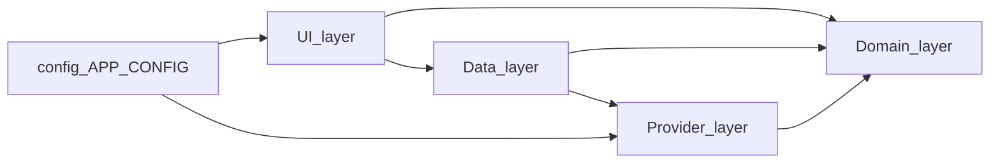

# MissionGrid

Volunteer-friendly, mobile-first **field coordination** for nonprofits and street teams: outreach, canvassing, literature drops, pickups, and other simple coverage tasks—without duplicating effort.

> **Rebrand in one file:** product name, slug, tagline, and description live in [`src/config/app.config.ts`](src/config/app.config.ts) (`APP_CONFIG`). Avoid hardcoding the product name elsewhere; import `APP_CONFIG` or branding components under `src/components/branding/`.

## Quickstart

```bash
npm install
npm run dev
```

Then open the URL Vite prints (usually `http://localhost:5173`).

- First launch goes to **`/setup`**. Use **Try sample data** for instant demo org + ~26 stops, or finish the wizard with your own CSV.
- **`/volunteer`** — time window + link to suggested route.
- **`/routes`** — greedy nearest-neighbor suggestions with one-tap claim / complete / skip (mock backend).
- Bottom tabs: Home, Routes, Stops, Map, Progress.
- **`/admin`** — overview, CSV import, review placeholder, volunteers; **Reset** returns to setup.

Other scripts: `npm run build`, `npm run preview`, `npm run typecheck`, `npm run lint`.

> **Note:** `vite-plugin-pwa` currently installs with `npm install … --legacy-peer-deps` because its peer range does not yet list Vite 8. The repo is configured for production PWA builds; adjust or pin Vite if you prefer strict peer resolution.

Copy [`.env.example`](.env.example) to `.env.local` when you add Phase 2 keys (never commit real secrets).

## Architecture (why this shape)

MissionGrid is meant to be **forked by nonprofits** and eventually **embedded** (e.g. WordPress). That favors:

1. **Clear boundaries** — swap Supabase for PocketBase/Firebase or Google Maps for MapLibre without rewriting screens.
2. **Static deploy** — Vite build to any static host; optional Phase 2 user-supplied backend URLs from the setup UI.
3. **Volunteer UX first** — thin routes, fat feature folders, shared primitives.

### Layers



| Layer | Folder | Responsibility |
|--------|--------|------------------|
| **UI** | `src/features/*`, `src/components/*` | Screens, layout, design system. No direct provider/SDK imports for async work. |
| **Data** | `src/data/*` | TanStack Query hooks, query keys, org/volunteer helpers. Calls `getRegistry()` only. |
| **Providers** | `src/providers/*` | `BackendProvider`, `MapProvider`, `GeocodingProvider`, registry; mock + stubs today. |
| **Domain** | `src/domain/*` | Types/models + pure services (e.g. routing heuristic, progress math). No React. |

**Phase 1 persistence:** the mock backend is a **Zustand store** (`src/store/mockBackendStore.ts`) so mutations feel shared. It is **not** a substitute for a real API—Phase 2 replaces `mockBackend` with `supabaseBackend` behind the same interface.

### Provider contracts (summary)

- **`BackendProvider`** — locations CRUD-style actions, CSV import, progress snapshot, optional realtime subscription hook (`subscribeLocations`). See [`src/providers/backend/BackendProvider.ts`](src/providers/backend/BackendProvider.ts).
- **`MapProvider`** — `renderMap(props)` returns a React tree; mock uses a schematic grid. See [`src/providers/maps/MapProvider.tsx`](src/providers/maps/MapProvider.tsx).
- **`GeocodingProvider`** — `geocode` / `reverse`; mock returns fixed center. See [`src/providers/geocoding/GeocodingProvider.ts`](src/providers/geocoding/GeocodingProvider.ts).

Registry: [`src/providers/registry.ts`](src/providers/registry.ts) (`getRegistry()`).

### Folder map (high level)

```
src/
  app/           App shell, router, React Query provider
  config/        APP_CONFIG, feature flags
  domain/        models + pure services
  providers/     integrations + registry
  data/          TanStack Query hooks
  features/      route-level screens
  components/    shared UI + layout + branding
  mock/          seed ids + reusable demo fixtures
  store/         Phase 1 mock persistence (Zustand)
  lib/           utils, CSV parsing
  styles/        Tailwind entry (globals)
```

## Domain model (TypeScript)

Defined under [`src/domain/models/`](src/domain/models/): **Organization**, **Volunteer**, **Location** (with `ActivityStatus`), **RouteSuggestion**, **SuggestedPlace** (Phase 3), **ServiceArea**, **AppConfiguration**.

## Brand string grep gate

After rebranding, search the repo for the old literal name. **Application code** should only reference the string via `APP_CONFIG` / branding helpers—see [`src/config/app.config.ts`](src/config/app.config.ts).

## Roadmap

See [`docs/ROADMAP.md`](docs/ROADMAP.md) for Phase 2 (Supabase + Maps + credentials UI) and Phase 3 (discovery, hours, smarter routing, embeds).

## License

MIT — see [`LICENSE`](LICENSE).
