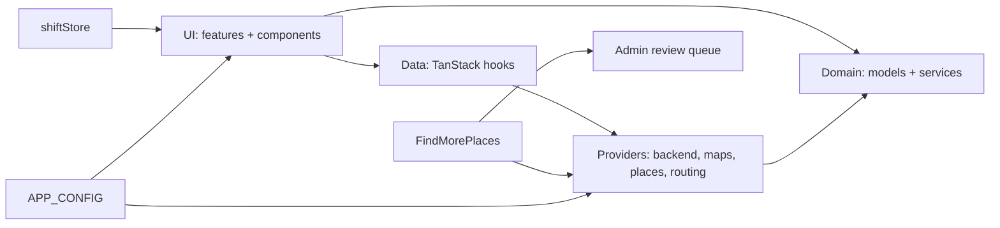

# MissionGrid

Volunteer-friendly, mobile-first **field coordination** for nonprofits and street teams — outreach, canvassing, pickups, local action, and other territory-based work, without duplicate effort.

**Positioning:** MissionGrid is **open-source-first**. Each organization brings its **own** Supabase project and Google Cloud keys. Nothing is tied to a central SaaS controlled by the repo owner — configure everything from the setup wizard or optional Vite env defaults.

> **Rebrand in one file:** product name, slug, tagline, routes, and storage key live in [`src/config/app.config.ts`](src/config/app.config.ts) (`APP_CONFIG`). Avoid hardcoding the product name elsewhere; import `APP_CONFIG` or branding components under `src/components/branding/`.

## Screens

Drop real PNGs into [`docs/screenshots/`](docs/screenshots/) to replace the placeholders below.

| | |
|---|---|
|  |  |
| Volunteer home — pick a time window and start a shift | Shift view — Navigate / Claim / Mark Complete / Skip |
|  |  |
| Map/List toggle with service-area overlay | Progress thermometer with 25/50/75/100% milestones |
|  |  |
| Admin overview with live activity feed | Suggested-places review queue |

## Quickstart

```bash
npm install --legacy-peer-deps
npm run dev
```

Open the URL Vite prints (usually `http://localhost:5173`).

| Route | Purpose |
|-------|---------|
| `/setup` | First-run wizard: mock org, or Supabase + Google + CSV + **volunteer invite link** |
| `/join#…` | Volunteers open the link from the coordinator; name + email signup (no password) |
| `/volunteer` | Home — pick a time window, start a shift |
| `/shift` | Active shift — Navigate / Claim / Complete / Skip / I have more time |
| `/locations` | Combined Places list + Map with service-area overlay |
| `/progress` | Organization-wide thermometer with per-area breakdown |
| `/admin`, `/admin/imports`, `/admin/review`, `/admin/volunteers` | Admin sub-pages |

Scripts: `npm run build`, `npm run preview`, `npm run typecheck`, `npm run lint`.

> **PWA:** `vite-plugin-pwa` may require `--legacy-peer-deps` with Vite 8 until peer ranges align.

## Sample nonprofit onboarding

A 10-minute end-to-end run a new coordinator can follow:

1. **Clone, install, run** the quickstart above, then visit `/setup`.
2. On the wizard, pick **Try sample data** if you just want to explore. The demo loads ~60 realistic stops (community centers, food pantries, clinics, faith spaces, transit hubs) so every screen shows off.
3. For a real org, pick **Guided setup — Supabase + invite link** and:
   - Create a Supabase project → run [`docs/supabase/schema.sql`](docs/supabase/schema.sql) in the SQL editor.
   - Paste Supabase URL + anon public key; click **Test connection**.
   - Create your admin email/password.
   - Optional: paste a Google Maps JavaScript API key ([see the Cloud setup guide](docs/google-cloud-setup.md)) to enable the live map, Places-based discovery, and CSV geocoding.
   - Draw a service area (center lat/lng + radius) or paste a GeoJSON polygon in the filter sheet later.
   - Paste or upload CSV — see [`docs/csv-format.md`](docs/csv-format.md) and [`docs/sample-locations.csv`](docs/sample-locations.csv).
4. Copy the **volunteer invite link** and share it (email, SMS, QR code). Volunteers open it on their phone and become members with just a first name + email.
5. First shift:
   - Volunteer opens the app, taps a time chip (10/20/30/60 min), and **Start my shift**.
   - The app suggests a route in the service area. They tap **Navigate** for turn-by-turn directions (opens Google Maps), **Claim** to hold a place, **Complete** when done, or **Skip**.
   - At the end of the route they can tap **I have 10 more minutes** to pull in nearby places — via internal candidates or (if configured) Google Places search. New places land in the **admin review queue** for approval.
6. Coordinator uses `/admin` to watch the live activity feed, track per-volunteer progress, approve new places, and import more CSVs whenever needed.

## Required services checklist

| Service | Required? | Used for |
|---------|-----------|----------|
| **None** | Optional | "Try sample data" / mock backend works fully offline on one device |
| **Supabase** | For shared teams | Postgres + Auth (admin email/password) + Realtime + `join_volunteer` RPC |
| **Google Maps Platform** | Optional | Live map, Places search, CSV geocoding |

## Environment vs UI configuration

| Mechanism | What it stores |
|-----------|----------------|
| **Setup wizard / invite link** | `localStorage` under `APP_CONFIG.storageKey` — Supabase URL, anon key, optional Google Maps key, `organizationId`, `volunteerId`, invite token. **Per browser.** |
| **`.env.local`** (optional) | `VITE_SUPABASE_*`, `VITE_GOOGLE_MAPS_API_KEY` — merged as defaults when UI fields are empty. Good for forks / CI. Never commit secrets. |

Force mock providers for debugging: `VITE_FORCE_MOCK_BACKEND`, `VITE_FORCE_MOCK_MAPS` (see [`.env.example`](.env.example)).

## Architecture

MissionGrid favors **clear boundaries** and a **static deploy**.



| Layer | Folder | Responsibility |
|--------|--------|----------------|
| **UI** | `src/features/*`, `src/components/*` | Screens + design system (buttons, chips, cards, thermometer, etc). Async work goes through data hooks. |
| **Data** | `src/data/*` | TanStack Query hooks. Uses **`useRegistry()`** from [`src/providers/useRegistry.ts`](src/providers/useRegistry.ts). |
| **Providers** | `src/providers/*` | `BackendProvider`, `MapProvider`, `GeocodingProvider`, `PlacesProvider`, `RoutingProvider`, [`createProviderRegistry`](src/providers/registry.ts). |
| **Domain** | `src/domain/*` | Types + pure services (`areaFilter`, `routeSuggestion`, `progress`). |

**Mock persistence:** [`src/store/mockBackendStore.ts`](src/store/mockBackendStore.ts) + location audit events + mock suggested-places queue. **Shift state:** [`src/store/shiftStore.ts`](src/store/shiftStore.ts) — persisted to `localStorage`, survives reloads in the field.

### Folder map

```
src/
  app/           Router, providers
  config/        APP_CONFIG, runtime merge helpers
  domain/        models + services (areaFilter, routing, progress)
  providers/     backend, maps, geocoding, places, routing, registry
  data/          TanStack Query hooks
  features/      setup, join, volunteer, shift, locations, progress, admin
  components/    UI library (button, chip, thermometer, location-card, …)
  store/         mock backend, runtime config, area filter, shift
  lib/           csv, distance, openHours, geocodeBatch
  embed.tsx      mount helper for WordPress / iframe embeds (stub)
docs/
  supabase/      schema + README
  screenshots/   preview images referenced from this README
  csv-format.md, sample-locations.csv, google-cloud-setup.md, ROADMAP.md
```

## Embedding (WordPress / iframe)

[`src/embed.tsx`](src/embed.tsx) exports `mountMissionGrid(target, options)` for hosts that want to render the app into an existing page. Options are merged into the runtime config store, so a WordPress shortcode can pass Supabase keys without touching the build:

```html
<div id="missiongrid"></div>
<script type="module">
  import { mountMissionGrid } from '/missiongrid/assets/embed.js'
  mountMissionGrid(document.getElementById('missiongrid'), {
    readUrlParams: true,
  })
</script>
```

Phase 3 tracks a dedicated UMD build + iframe-friendly styles.

## PWA & offline

- Installable via `beforeinstallprompt`; a dismissible install card shows on the volunteer home.
- TanStack Query runs with `networkMode: 'offlineFirst'` and exponential retry so the app stays responsive on flaky cellular.
- A slim **ConnectionBanner** surfaces offline/reconnecting state above the header.
- Full offline write queueing is a Phase 3 goal.

## Supabase schema

Single source of truth: [`docs/supabase/schema.sql`](docs/supabase/schema.sql) — organizations, volunteers, service areas, locations, `org_invites`, `app_configuration`, `location_history`, RLS (permissive for self-hosted single-tenant; tighten for multi-tenant).

The suggested-places review queue is mock-only in this phase; the relevant `BackendProvider` methods are optional (`listSuggestedPlaces`, `approveSuggestedPlace`, `rejectSuggestedPlace`) and will light up in admin once a Supabase schema lands for them.

## Brand string grep gate

After rebranding, search the repo for the old literal name. Application code should reference branding via `APP_CONFIG` / [`src/components/branding/`](src/components/branding/).

## Roadmap

See [`docs/ROADMAP.md`](docs/ROADMAP.md).

## License

MIT — see [`LICENSE`](LICENSE).
