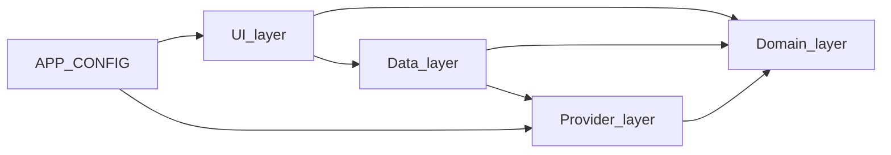

# MissionGrid

Volunteer-friendly, mobile-first **field coordination** for nonprofits and street teams: outreach, canvassing, literature drops, pickups, and other territory-based tasks—without duplicating effort.

**Positioning:** MissionGrid is **open-source-first**. Each organization brings **its own** Supabase project and Google Cloud keys. Nothing is tied to a central SaaS controlled by the repo owner—configure everything from the setup wizard or optional Vite env defaults.

> **Rebrand in one file:** product name, slug, tagline, routes, and storage key live in [`src/config/app.config.ts`](src/config/app.config.ts) (`APP_CONFIG`). Avoid hardcoding the product name elsewhere; import `APP_CONFIG` or branding components under `src/components/branding/`.

## Quickstart

```bash
npm install --legacy-peer-deps
npm run dev
```

Open the URL Vite prints (usually `http://localhost:5173`).

| Route | Purpose |
|-------|---------|
| **`/setup`** | First-run wizard: mock org, or Supabase + Google + CSV + **volunteer invite link** |
| **`/join#…`** | Volunteers open the link from the coordinator; name + email signup (no password) |
| **`/volunteer`** | Home: time window → suggested route |
| **`/routes`** | Greedy nearest-neighbor route; claim / complete / skip |
| **`/locations`**, **`/map`**, **`/progress`** | Tabs in the shell |
| **`/admin`** | Overview, **CSV import** (preview + geocode), volunteers; **Reset** clears mock + runtime keys |

Scripts: `npm run build`, `npm run preview`, `npm run typecheck`, `npm run lint`.

> **PWA:** `vite-plugin-pwa` may require `--legacy-peer-deps` with Vite 8 until peer ranges align.

## Required services checklist

| Service | Required? | Used for |
|---------|-----------|----------|
| **None** | Optional | “Try sample data” / mock backend works fully offline on one device |
| **Supabase** | For shared teams | Postgres + Auth (admin email/password) + Realtime + `join_volunteer` RPC |
| **Google Maps Platform** | Optional | Live map, Places search in area tools, CSV geocoding |

## Setup (non-technical webmaster)

1. **Fork or deploy** this static app (any static host).  
2. **Supabase:** create a project → run [`docs/supabase/schema.sql`](docs/supabase/schema.sql) in the SQL editor → copy **Project URL** + **anon public** key.  
3. **Google Cloud (optional):** follow [`docs/google-cloud-setup.md`](docs/google-cloud-setup.md), create a browser-restricted API key.  
4. Open **`/setup`** → choose **Guided setup — Supabase + invite link** → paste keys → create admin account → optional Google step → service area → CSV (or use sample rows) → **Create cloud org**.  
5. **Copy the invite link** and share it (social, email, QR). Volunteers use **`/join`**.  
6. **CSV format:** see [`docs/csv-format.md`](docs/csv-format.md) and [`docs/sample-locations.csv`](docs/sample-locations.csv).

More detail: [`docs/supabase/README.md`](docs/supabase/README.md).

## Environment vs UI configuration

| Mechanism | What it stores |
|-----------|----------------|
| **Setup wizard / invite link** | `localStorage` under `APP_CONFIG.storageKey` — Supabase URL, anon key, optional Google Maps key, `organizationId`, `volunteerId`, invite token. **Per browser.** |
| **`.env.local`** (optional) | `VITE_SUPABASE_*`, `VITE_GOOGLE_MAPS_API_KEY` — merged as defaults when UI fields are empty. Good for forks / CI. Never commit secrets. |

Force mock providers for debugging: `VITE_FORCE_MOCK_BACKEND`, `VITE_FORCE_MOCK_MAPS` (see [`.env.example`](.env.example)).

## Architecture

MissionGrid favors **clear boundaries** and a **static deploy**.

### Layers



| Layer | Folder | Responsibility |
|--------|--------|----------------|
| **UI** | `src/features/*`, `src/components/*` | Screens, layout. Async work goes through data hooks. |
| **Data** | `src/data/*` | TanStack Query hooks. Uses **`useRegistry()`** from [`src/providers/useRegistry.ts`](src/providers/useRegistry.ts). |
| **Providers** | `src/providers/*` | `BackendProvider`, `MapProvider`, `GeocodingProvider`, **`PlacesProvider`**, **`RoutingProvider`**, [`createProviderRegistry`](src/providers/registry.ts). |
| **Domain** | `src/domain/*` | Types + pure services (`areaFilter`, `routeSuggestion`, `progress`). |

**Mock persistence:** [`src/store/mockBackendStore.ts`](src/store/mockBackendStore.ts) + location audit events. **Supabase:** same `BackendProvider` contract + Postgres triggers for `location_history`.

### Supabase schema

Single source of truth: [`docs/supabase/schema.sql`](docs/supabase/schema.sql) — organizations, volunteers, service areas, locations, `org_invites`, `app_configuration`, `location_history`, RLS (permissive for self-hosted single-tenant; tighten for multi-tenant).

### Folder map

```
src/
  app/           Router, providers
  config/        APP_CONFIG, runtime merge helpers
  domain/        models + services (areaFilter, routing, progress)
  providers/     backend, maps, geocoding, places, routing, registry
  data/          TanStack Query hooks
  features/      setup, join, volunteer, routes, admin, map, …
  store/         mock backend, runtime config, area filter
  lib/           csv, geocodeBatch
docs/
  supabase/      schema + README
  csv-format.md, sample-locations.csv, google-cloud-setup.md, ROADMAP.md
```

## Brand string grep gate

After rebranding, search the repo for the old literal name. Application code should reference branding via `APP_CONFIG` / [`src/components/branding/`](src/components/branding/).

## Roadmap

See [`docs/ROADMAP.md`](docs/ROADMAP.md).

## License

MIT — see [`LICENSE`](LICENSE).
