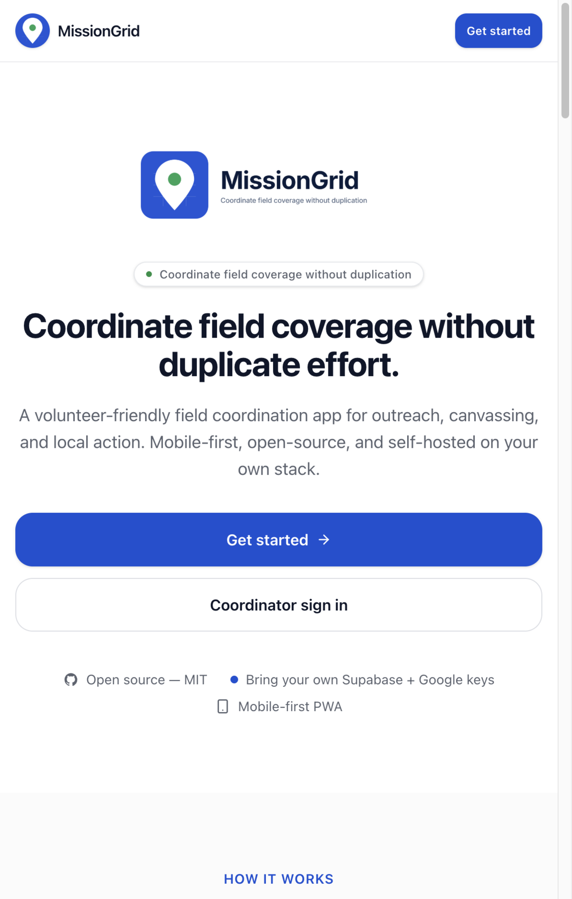
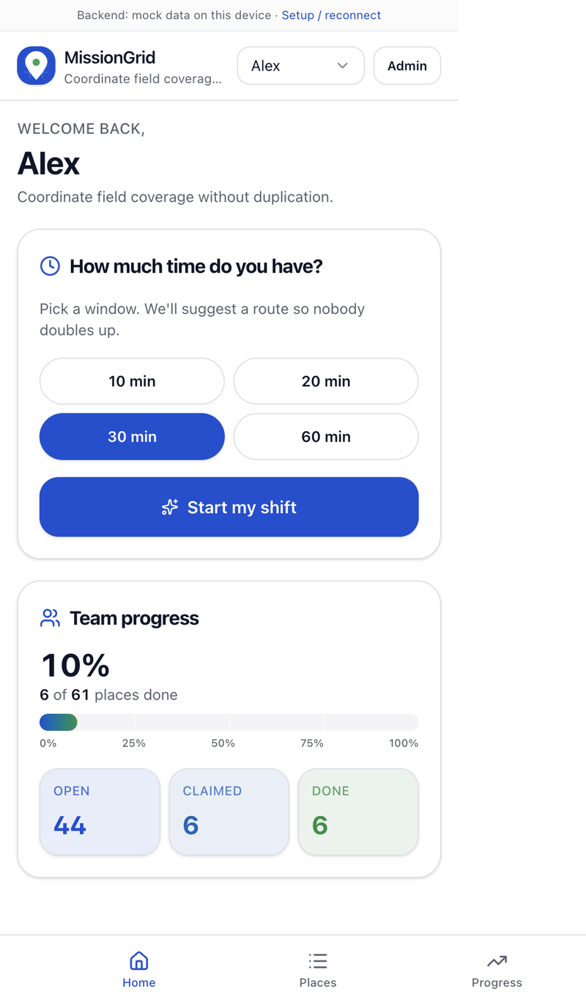
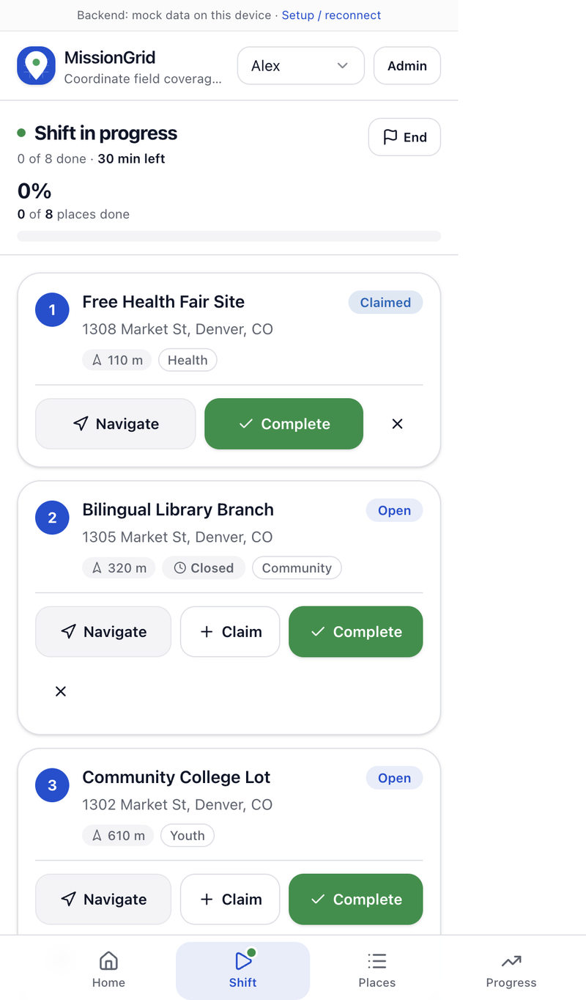
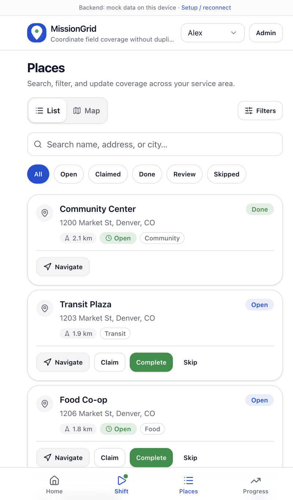
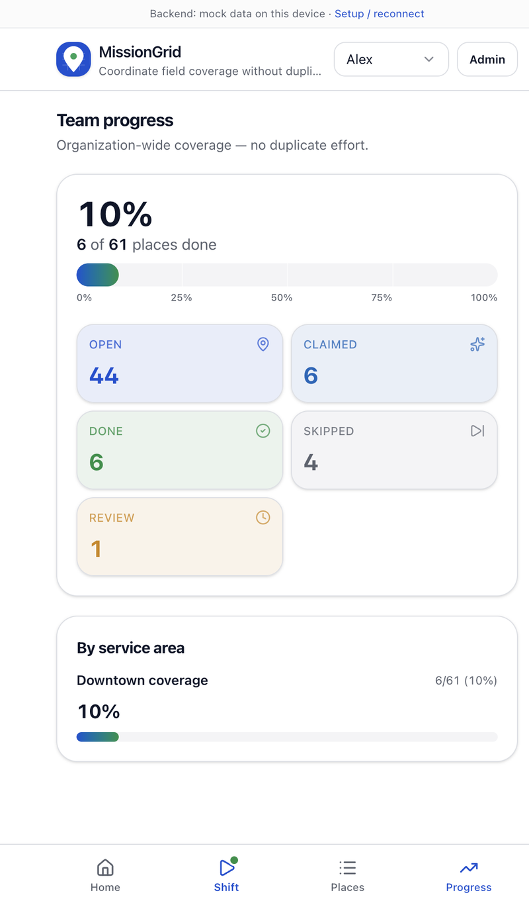
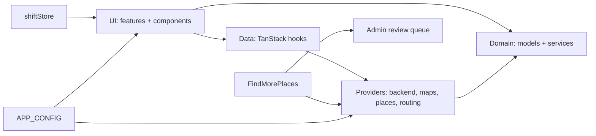

# MissionGrid

Volunteer-friendly, mobile-first **field coordination** for nonprofits and street teams — outreach, canvassing, pickups, local action, and other territory-based work, without duplicate effort.

**Positioning:** MissionGrid is **open-source-first**. Each organization brings its **own** Supabase project and Google Cloud keys. Nothing is tied to a central SaaS controlled by the repo owner — configure everything from the setup wizard or optional Vite env defaults.

> **Rebrand in one file:** product name, slug, tagline, routes, and storage key live in [`src/config/app.config.ts`](src/config/app.config.ts) (`APP_CONFIG`). Avoid hardcoding the product name elsewhere; import `APP_CONFIG` or branding components under `src/components/branding/`.

<p align="center">
  <a href="src/assets/screenshots/landing-hero.png">
    
  </a>
</p>

The public landing page lives at `/` and scrolls through the pitch, how it works, features, personas, open-source / BYOK, and FAQ. Deploy it to Vercel as-is — everything after `Get started` funnels into the setup wizard, and existing users land back in the app.

## Deploy

MissionGrid is a purely client-side SPA, so a single public build can serve every organization — each one brings their own Supabase + Google keys through `/setup` and those stay in their browser's `localStorage`. No server secrets are ever deployed.

[](https://vercel.com/new/clone?repository-url=https://github.com/%3Cowner%3E/MissionGrid)

> Replace `<owner>` in the button link with the GitHub org/user that owns the public fork.

One-time steps after clicking Deploy (or importing the repo manually in Vercel):

1. Accept the detected **Vite** framework preset — [`vercel.json`](vercel.json) overrides the install command to use `--legacy-peer-deps` and wires up SPA rewrites so `/`, `/setup`, `/join`, `/volunteer`, `/shift`, and `/admin/*` all work on direct load and refresh.
2. Leave **Environment Variables** empty for a clean public deploy. Orgs paste their own keys at `/setup` — you never hold their secrets.
3. Hit **Deploy**. First build is ~1–2 minutes. You'll get a `your-project.vercel.app` URL immediately; a custom domain can be attached later under **Project → Settings → Domains**.

Then, per organization:

- **Google Maps:** After the site is live, the admin must add the Vercel domain (`your-project.vercel.app` and any custom domain) to the **HTTP referrer allowlist** of their Google Maps API key in Google Cloud, otherwise the Maps JS loader will block the key. See [`docs/google-cloud-setup.md`](docs/google-cloud-setup.md).
- **Supabase:** The browser anon key needs no domain config to work. If the org enables email-based auth flows, add the Vercel URL(s) to Supabase Auth's **Site URL** and **Redirect URLs**.

### Alternatives

Any static host works — Netlify, Cloudflare Pages, GitHub Pages (the last one needs a `base` path tweak in [`vite.config.ts`](vite.config.ts)). Cloudflare Pages is the best free backup with unlimited bandwidth. The `vercel.json` rewrites translate 1:1 to a Netlify `_redirects` file (`/* /index.html 200`) or a Cloudflare Pages `_redirects`.

### Caveats worth knowing

- **localStorage is per-browser.** An admin who clears site data, uses a new device, or opens incognito will re-run `/setup`. Keep the invite link and Supabase credentials somewhere safe.
- **The Supabase anon key is visible in the browser.** That's expected for Supabase; [`docs/supabase/schema.sql`](docs/supabase/schema.sql) uses RLS as the security boundary — tighten it before going multi-tenant.
- **PWA service worker.** [`vercel.json`](vercel.json) sets `Cache-Control: max-age=0, must-revalidate` on `/sw.js` so new deploys propagate instead of sticking volunteers on a stale bundle.

## Screens

Captures come from the built-in **Try sample data** mode — no Supabase or Google keys needed to reproduce any of these locally.

| | |
|---|---|
|  |  |
| **Volunteer home** — pick a time window (10 / 20 / 30 / 60 min) and start a shift. Team-progress card shows the org-wide thermometer and open/claimed/done counts. | **Shift view** — numbered route stops with Navigate / Claim / Complete / Skip, a sticky timer, and "have more time" chips at the bottom to pull in extra nearby places. |
|  |  |
| **Places** — List / Map toggle, full-text search, and status filters (All / Open / Claimed / Done / Review / Skipped) with inline Navigate / Claim / Complete / Skip actions on every card. | **Progress** — org-wide thermometer with 25 / 50 / 75 / 100% milestones, per-status breakdown, and per-service-area coverage rows. |

## Quickstart

```bash
npm install --legacy-peer-deps
npm run dev
```

Open the URL Vite prints (usually `http://localhost:5173`).

| Route | Purpose |
|-------|---------|
| `/` | Public landing page — hero, how it works, features, personas, open-source / BYOK, FAQ |
| `/setup` | First-run wizard: mock org, or Supabase + Google + CSV + **volunteer invite link** |
| `/join#…` | Volunteers open the link from the coordinator; name + email signup (no password) |
| `/join-shift#…` | Walk-ups scan the QR code from the shift leader and add themselves to the active party with just a first name |
| `/volunteer` | Home — pick a time window, pick party size + campaign, start a shift |
| `/shift` | Active shift — Navigate / Claim / Complete / Skip / Invite walk-ups |
| `/locations` | Combined Places list + Map with service-area overlay |
| `/progress` | Organization-wide thermometer with per-area breakdown |
| `/admin`, `/admin/campaigns`, `/admin/campaigns/:id`, `/admin/imports`, `/admin/review`, `/admin/volunteers` | Admin sub-pages (campaigns page downloads grant-ready PDF + CSV) |

Scripts: `npm run build`, `npm run preview`, `npm run typecheck`, `npm run lint`.

> **PWA:** `vite-plugin-pwa` may require `--legacy-peer-deps` with Vite 8 until peer ranges align.

## Sample nonprofit onboarding

A 10-minute end-to-end run a new coordinator can follow:

1. **Clone, install, run** the quickstart above. Open the landing page at `/` for the pitch, then click **Get started** to drop into `/setup`.
2. On the wizard, pick **Try sample data** if you just want to explore. The demo loads ~60 realistic stops (community centers, food pantries, clinics, faith spaces, transit hubs) so every screen shows off.
3. For a real org, pick **Guided setup — Supabase + invite link** and:
   - Create a Supabase project → run [`docs/supabase/schema.sql`](docs/supabase/schema.sql) in the SQL editor.
   - Paste Supabase URL + anon public key; click **Test connection**.
   - Create your admin email/password.
   - Optional: paste a Google Maps JavaScript API key ([see the Cloud setup guide](docs/google-cloud-setup.md)) to enable the live map, Places-based discovery, and CSV geocoding.
   - Draw a service area (center lat/lng + radius) or paste a GeoJSON polygon in the filter sheet later.
   - Paste or upload CSV — see [`docs/csv-format.md`](docs/csv-format.md) and [`docs/sample-locations.csv`](docs/sample-locations.csv).
4. Copy the **volunteer invite link** and share it (email, SMS, QR code). Volunteers open it on their phone and become members with just a first name + email.
5. First shift:
   - Volunteer opens the app, taps a time chip (10/20/30/60 min), and **Start my shift**.
   - The app suggests a route in the service area. They tap **Navigate** for turn-by-turn directions (opens Google Maps), **Claim** to hold a place, **Complete** when done, or **Skip**.
   - At the end of the route they can tap **I have 10 more minutes** to pull in nearby places — via internal candidates or (if configured) Google Places search. New places land in the **admin review queue** for approval.
6. Coordinator uses `/admin` to watch the live activity feed, track per-volunteer progress, approve new places, and import more CSVs whenever needed.

## Required services checklist

| Service | Required? | Used for |
|---------|-----------|----------|
| **None** | Optional | "Try sample data" / mock backend works fully offline on one device |
| **Supabase** | For shared teams | Postgres + Auth (admin email/password) + Realtime + `join_volunteer` RPC |
| **Google Maps Platform** | Optional | Live map, Places search, CSV geocoding |

## Environment vs UI configuration

| Mechanism | What it stores |
|-----------|----------------|
| **Setup wizard / invite link** | `localStorage` under `APP_CONFIG.storageKey` — Supabase URL, anon key, optional Google Maps key, `organizationId`, `volunteerId`, invite token. **Per browser.** |
| **`.env.local`** (optional) | `VITE_SUPABASE_*`, `VITE_GOOGLE_MAPS_API_KEY` — merged as defaults when UI fields are empty. Good for forks / CI. Never commit secrets. |

Force mock providers for debugging: `VITE_FORCE_MOCK_BACKEND`, `VITE_FORCE_MOCK_MAPS` (see [`.env.example`](.env.example)).

## Architecture

MissionGrid favors **clear boundaries** and a **static deploy**.



| Layer | Folder | Responsibility |
|--------|--------|----------------|
| **UI** | `src/features/*`, `src/components/*` | Screens + design system (buttons, chips, cards, thermometer, etc). Async work goes through data hooks. |
| **Data** | `src/data/*` | TanStack Query hooks. Uses **`useRegistry()`** from [`src/providers/useRegistry.ts`](src/providers/useRegistry.ts). |
| **Providers** | `src/providers/*` | `BackendProvider`, `MapProvider`, `GeocodingProvider`, `PlacesProvider`, `RoutingProvider`, [`createProviderRegistry`](src/providers/registry.ts). |
| **Domain** | `src/domain/*` | Types + pure services (`areaFilter`, `routeSuggestion`, `progress`). |

**Mock persistence:** [`src/store/mockBackendStore.ts`](src/store/mockBackendStore.ts) + location audit events + mock suggested-places queue. **Shift state:** [`src/store/shiftStore.ts`](src/store/shiftStore.ts) — persisted to `localStorage`, survives reloads in the field.

### Folder map

```
src/
  app/           Router, providers
  config/        APP_CONFIG, runtime merge helpers
  domain/        models + services (areaFilter, routing, progress)
  providers/     backend, maps, geocoding, places, routing, registry
  data/          TanStack Query hooks
  features/      setup, join, volunteer, shift, locations, progress, admin
  components/    UI library (button, chip, thermometer, location-card, …)
  store/         mock backend, runtime config, area filter, shift
  lib/           csv, distance, openHours, geocodeBatch
  embed.tsx      mount helper for WordPress / iframe embeds (stub)
docs/
  supabase/      schema + README
  screenshots/   preview images referenced from this README
  csv-format.md, sample-locations.csv, google-cloud-setup.md, ROADMAP.md
```

## Embedding (WordPress / iframe)

[`src/embed.tsx`](src/embed.tsx) exports `mountMissionGrid(target, options)` for hosts that want to render the app into an existing page. Options are merged into the runtime config store, so a WordPress shortcode can pass Supabase keys without touching the build:

```html
<div id="missiongrid"></div>
<script type="module">
  import { mountMissionGrid } from '/missiongrid/assets/embed.js'
  mountMissionGrid(document.getElementById('missiongrid'), {
    readUrlParams: true,
  })
</script>
```

Phase 3 tracks a dedicated UMD build + iframe-friendly styles.

## PWA & offline

- Installable via `beforeinstallprompt`; a dismissible install card shows on the volunteer home.
- TanStack Query runs with `networkMode: 'offlineFirst'` and exponential retry so the app stays responsive on flaky cellular.
- A slim **ConnectionBanner** surfaces offline/reconnecting state above the header.
- Full offline write queueing is a Phase 3 goal.

## Campaigns & grant reporting

When a grant officer asks "how were the funds spent?", MissionGrid rolls every shift up into a **Campaign** and hands you a one-click PDF + CSV.

- Admins create Campaigns from **`/admin/campaigns`** (name, optional grant reference number, start/end dates, description).
- Volunteers tag a campaign on the Volunteer home before they tap **Start my shift**, alongside a **"Who's with you?"** chip row (`Just me`, `+1`, `+2`, `+3`, stepper for larger groups). Party size multiplies into volunteer-hour totals.
- When someone shows up unannounced, the shift leader taps **Invite** in the shift header. A bottom sheet shows a QR code + shareable link (`/join-shift#mg-party-v1.<b64>`), which the walk-up scans and enters a first name to join the party via the `join_shift_party` RPC. Their stops attribute to the shift and member.
- On **`/admin/campaigns/:id`** admins see total volunteer hours, stops completed, headcount, and shift-by-shift breakdown, with **Download PDF** and **Download CSV** buttons. PDF is rendered client-side via `jspdf` + `jspdf-autotable`; CSV is flat rows ready for pivoting.

Schema for campaigns + shifts + shift_members + the `record_location_action` / `start_shift` / `end_shift` / `generate_party_token` / `join_shift_party` / `update_shift_party_size` RPCs is in [`docs/supabase/schema.sql`](docs/supabase/schema.sql). See the upgrade notes in [`docs/supabase/README.md`](docs/supabase/README.md#upgrading-an-existing-project-campaigns--shifts--party-join).

> Screenshot placeholder: `src/assets/screenshots/campaign-report.png` — add after first real PDF export.

## Supabase schema

Single source of truth: [`docs/supabase/schema.sql`](docs/supabase/schema.sql) — organizations, volunteers, service areas, locations, `org_invites`, `app_configuration`, `location_history`, campaigns, shifts, `shift_members`, RLS (permissive for self-hosted single-tenant; tighten for multi-tenant).

The suggested-places review queue is mock-only in this phase; the relevant `BackendProvider` methods are optional (`listSuggestedPlaces`, `approveSuggestedPlace`, `rejectSuggestedPlace`) and will light up in admin once a Supabase schema lands for them.

## Brand string grep gate

After rebranding, search the repo for the old literal name. Application code should reference branding via `APP_CONFIG` / [`src/components/branding/`](src/components/branding/).

## Roadmap

See [`docs/ROADMAP.md`](docs/ROADMAP.md).

## License

MIT — see [`LICENSE`](LICENSE).
